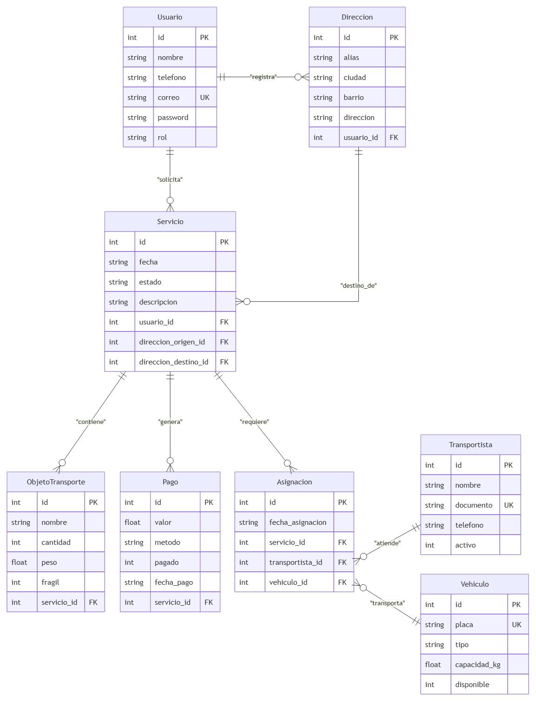

# API de Gestión de MueveloYa

API REST desarrollada con FastAPI para la prestación de servicios de transporte de objetos y mudanzas.

El proyecto permite administrar las entidades principales del negocio mediante operaciones CRUD, consultas relacionales, autenticación JWT y control de permisos por roles.

---

## Objetivo y Alcance

Desarrollar una API que solucione la logística de Obtención y gestión de servicios de transporte de objetos y mudanzas, facilitando la solicitud, asignación y seguimiento de los mismos de forma segura.

---

## Integrantes

- Sebastian Ramirez Castrillon
- Joel Andrés Mendoza Buritica
- Juan Sebastian Ramirez Velez
- Andrés Felipe Vargas Metrio
- Sergio Andrés López Sepúlveda

---

## Tecnologías

- Python
- FastAPI
- SQLite
- PyJWT
- bcrypt / Passlib

---

## Requisitos Previos

Antes de comenzar, asegúrate de contar con lo siguiente instalado en tu sistema:

- **Python:** Versión 3.10 o superior (`python --version` o `python3 --version`).
- **Pip:** Administrador de paquetes de Python (`pip --version`).
- **Git:** Control de versiones para clonar el repositorio (`git --version`).

---

## Instalación y Ejecución

Para ejecutar el proyecto en un entorno local sigue estos pasos:

### 1. Clonar el repositorio

```bash
git clone https://github.com/pipemetrio/Muevelo_Ya_FastAPI.git
cd Muevelo_Ya_FastAPI
```

### 2. Crear y activar un entorno virtual

```Bash
python -m venv venv
source venv/Scripts/activate
```

### 3. Instalar las dependencias

```Bash
pip install -r requirements.txt
```

### 4. Iniciar la aplicación

Ejecuta el servidor de desarrollo con Uvicorn:

```Bash
uvicorn main:app --reload
```

Al iniciar la aplicación por primera vez, las tablas y los datos de prueba (sembrado de datos) se crearán de forma automática en la base de datos SQLite.
El servidor estará disponible en: http://127.0.0.1:8000

### 5. Acceder a la documentación interactiva

Abre tu navegador web y visita:

Swagger UI: http://127.0.0.1:8000/docs

---

## Usuarios de Ejemplo

Para las pruebas de autenticación y permisos, utiliza las siguientes credenciales (sembradas por defecto):

| Correo electrónico    | Rol                                 | Contraseña       |
| --------------------- | ----------------------------------- | ---------------- |
| admin@mueveloya.com   | Administrador (`admin`)             | admin123         |
| cliente@mueveloya.com | Cliente (`cliente`)                 | cliente123       |
| driver1@mueveloya.com | Transportista (`transportista`)     | transportista123 |
---

## Diagrama Entidad-Relación

## 

---

## Tabla de Endpoints

| Método     | Ruta                         | Permiso     | Descripción                                               |
| :--------- | :--------------------------- | :---------- | :-------------------------------------------------------- |
| **POST**   | `/auth/registro`             | Público     | Registro inicial de clientes                              |
| **POST**   | `/auth/login`                | Público     | Autenticación y obtención de token JWT                    |
| **GET**    | `/usuarios`                  | Autenticado | Listado general de usuarios                               |
| **GET**    | `/usuarios/{id}`             | Autenticado | Consulta de usuario con sus direcciones anidadas (JOIN)   |
| **GET**    | `/usuarios/{id}/direcciones` | Autenticado | Obtener direcciones de un usuario específico              |
| **POST**   | `/usuarios`                  | Admin       | Creación directa de usuarios con asignación de rol        |
| **PUT**    | `/usuarios/{id}`             | Autenticado | Actualización de datos del usuario                        |
| **DELETE** | `/usuarios/{id}`             | Admin       | Eliminación de un usuario                                 |
| **GET**    | `/transportistas`            | Autenticado | Listar transportistas                                     |
| **GET**    | `/transportistas/{id}`       | Autenticado | Consultar transportista por ID                            |
| **POST**   | `/transportistas`            | Admin       | Registrar transportista                                   |
| **PUT**    | `/transportistas/{id}`       | Admin       | Actualizar transportista                                  |
| **DELETE** | `/transportistas/{id}`       | Admin       | Eliminar transportista                                    |
| **GET**    | `/vehiculos`                 | Autenticado | Listar vehículos                                          |
| **GET**    | `/vehiculos/{id}`            | Autenticado | Consultar vehículo por ID                                 |
| **POST**   | `/vehiculos`                 | Admin       | Registrar vehículo                                        |
| **PUT**    | `/vehiculos/{id}`            | Admin       | Actualizar vehículo                                       |
| **DELETE** | `/vehiculos/{id}`            | Admin       | Eliminar vehículo                                         |
| **GET**    | `/direcciones`               | Autenticado | Listar todas las direcciones                              |
| **GET**    | `/direcciones/{id}`          | Autenticado | Consultar dirección por ID                                |
| **POST**   | `/direcciones`               | Autenticado | Registrar nueva dirección                                 |
| **PUT**    | `/direcciones/{id}`          | Autenticado | Actualizar dirección existente                            |
| **DELETE** | `/direcciones/{id}`          | Autenticado | Eliminar dirección                                        |
| **GET**    | `/servicios`                 | Autenticado | Listar todos los servicios                                |
| **GET**    | `/servicios/{id}`            | Autenticado | Consultar servicio por ID (JOIN cliente, origen, destino) |
| **GET**    | `/servicios/{id}/objetos`    | Autenticado | Consultar objetos vinculados a un servicio                |
| **POST**   | `/servicios`                 | Autenticado | Crear/solicitar nuevo servicio                            |
| **PUT**    | `/servicios/{id}`            | Autenticado | Actualizar información de servicio                        |
| **DELETE** | `/servicios/{id}`            | Autenticado | Eliminar servicio                                         |
| **GET**    | `/objetos-transporte`        | Autenticado | Listar objetos de transporte                              |
| **GET**    | `/objetos-transporte/{id}`   | Autenticado | Consultar objeto por ID                                   |
| **POST**   | `/objetos-transporte`        | Autenticado | Registrar objeto dentro de un servicio                    |
| **PUT**    | `/objetos-transporte/{id}`   | Autenticado | Actualizar objeto                                         |
| **DELETE** | `/objetos-transporte/{id}`   | Autenticado | Eliminar objeto                                           |
| **GET**    | `/asignaciones`              | Autenticado | Listar asignaciones logísticas                            |
| **GET**    | `/asignaciones/{id}`         | Autenticado | Consultar asignación por ID                               |
| **POST**   | `/asignaciones`              | Autenticado | Asignar servicio a transportista y vehículo               |
| **PUT**    | `/asignaciones/{id}`         | Autenticado | Actualizar asignación                                     |
| **DELETE** | `/asignaciones/{id}`         | Autenticado | Cancelar o eliminar asignación                            |
| **GET**    | `/pagos`                     | Autenticado | Listar pagos                                              |
| **GET**    | `/pagos/{id}`                | Autenticado | Consultar pago por ID                                     |
| **POST**   | `/pagos`                     | Autenticado | Registrar pago de un servicio                             |
| **PUT**    | `/pagos/{id}`                | Autenticado | Actualizar estado o valor de pago                         |
| **DELETE** | `/pagos/{id}`                | Autenticado | Anular pago                                               |

---

## Referencias

- FastAPI. (2026). _FastAPI Documentation_. https://fastapi.tiangolo.com/
- SQLite. (2026). _SQLite Documentation_. https://www.sqlite.org/docs.html
