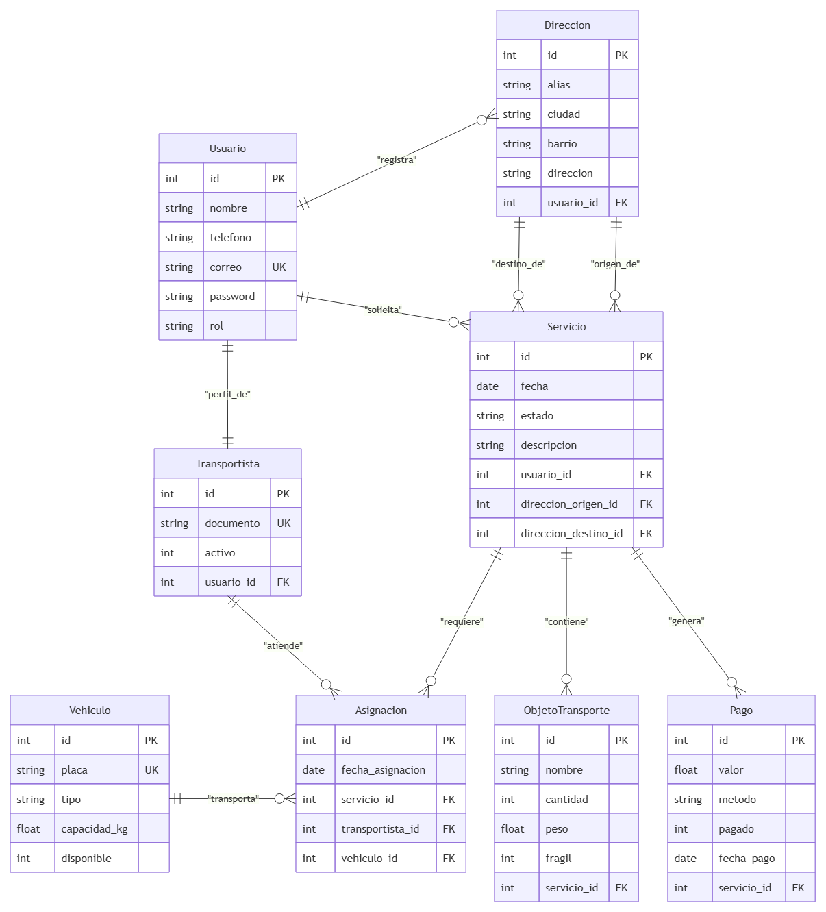

# API de Gestión de MueveloYa

API REST desarrollada con FastAPI para la prestación de servicios de transporte de objetos y mudanzas.

---

## Objetivo y Alcance

Desarrollar una API que solucione la logística de Obtención y gestión de servicios de transporte de objetos y mudanzas, facilitando la solicitud, asignación y seguimiento de los mismos de forma segura.

El proyecto permite administrar las entidades principales del negocio mediante operaciones CRUD, consultas relacionales, autenticación JWT y control de permisos por roles.

---

## Integrantes

- Sebastian Ramirez Castrillon
- Joel Andrés Mendoza Buritica
- Juan Sebastian Ramirez Velez
- Andrés Felipe Vargas Metrio
- Sergio Andrés López Sepúlveda

---

## Tecnologías

- Python
- FastAPI
- SQLite
- PyJWT
- bcrypt / Passlib

---

## Requisitos Previos

Antes de comenzar, asegúrate de contar con lo siguiente instalado en tu sistema:

- **Python:** Versión 3.10 o superior (`python --version` o `python3 --version`).
- **Pip:** Administrador de paquetes de Python (`pip --version`).
- **Git:** Control de versiones para clonar el repositorio (`git --version`).

---

## Instalación y Ejecución

Para ejecutar el proyecto en un entorno local sigue estos pasos:

### 1. Clonar el repositorio

```bash
git clone https://github.com/pipemetrio/Muevelo_Ya_FastAPI.git
cd Muevelo_Ya_FastAPI
```

### 2. Crear y activar un entorno virtual

```Bash
python -m venv venv
source venv/Scripts/activate
```

### 3. Instalar las dependencias

```Bash
pip install -r requirements.txt
```

### 4. Iniciar la aplicación

Ejecuta el servidor de desarrollo con Uvicorn:

```Bash
uvicorn main:app --host 0.0.0.0 --port $PORT
```

Al iniciar la aplicación por primera vez, las tablas y los datos de prueba (sembrado de datos) se crearán de forma automática en la base de datos SQLite.
El servidor estará disponible en: https://muevelo-ya-fastapi.onrender.com

### 5. Acceder a la documentación interactiva

Abre tu navegador web y visita:

Swagger UI: https://muevelo-ya-fastapi.onrender.com/docs

---

## Usuarios de Ejemplo

Para las pruebas de autenticación y permisos, utiliza las siguientes credenciales (sembradas por defecto):

| Correo electrónico    | Rol                             | Contraseña       |
| --------------------- | ------------------------------- | ---------------- |
| admin@mueveloya.com   | Administrador (`admin`)         | admin123         |
| cliente@mueveloya.com | Cliente (`cliente`)             | cliente123       |
| driver1@mueveloya.com | Transportista (`transportista`) | transportista123 |

---

---

## Variables de Entorno Requeridas

Para configurar correctamente el despliegue y la seguridad de la aplicación en producción, se deben definir las siguientes variables en el panel del servicio:

| Variable | Descripción | Ejemplo de Uso |
| :--- | :--- | :--- |
| `SECRET_KEY` | Clave criptográfica privada para la firma de tokens JWT. | `super_secret_key_production` |
| `ALGORITHM` | Algoritmo criptográfico utilizado para cifrar los tokens. | `HS256` |
| `TIEMPO_EXPIRACION_MINUTOS` | Tiempo de vigencia del token de acceso en minutos. | `30` |
| `ADMIN_PASSWORD` | Contraseña asignada para el usuario administrador inicial. | `admin_secure_pass` |

---

## Limitaciones Conocidas del Plan Gratuito

El sistema se encuentra desplegado utilizando la infraestructura del plan gratuito de Render, lo cual conlleva restricciones técnicas específicas:

* **Suspensión por inactividad (Spin down):** Tras un período de quince minutos sin recibir peticiones HTTP, el servicio suspende la instancia para optimizar recursos. La siguiente petición se encarga de despertar el servidor, generando un retraso aproximado de cincuenta segundos en la respuesta inicial.
* **Sistema de archivos efímero:** El almacenamiento en disco del contenedor es volátil. Cada redespliegue o reinicio elimina el archivo de base de datos local (`mueveloya.db`), reconstruyéndose automáticamente desde cero mediante los scripts de inicialización. Como solución de arquitectura para producción, se debe migrar la persistencia hacia un servicio de base de datos relacional gestionado externamente como PostgreSQL.

---

## Bitácora de Despliegue y Fallos (Paso 5)

Registro histórico de los errores analizados durante el proceso de despliegue en la nube, su causa raíz y la respectiva corrección aplicada:

| Mensaje de Error / Incidencia | Causa Raíz | Corrección Aplicada |
| :--- | :--- | :--- |
| `ModuleNotFoundError` durante el arranque | La dependencia requerida no se encontraba declarada en el archivo `requirements.txt`. | Instalación local de la librería, actualización del archivo con `pip freeze > requirements.txt` y envío del cambio mediante commit. |
| `No open ports detected` | El servidor arrancó escuchando de manera local en `127.0.0.1` o en un puerto estático en lugar de la interfaz pública. | Actualización del comando de inicio (*Start Command*) en Render para usar los parámetros `--host 0.0.0.0 --port $PORT`. |
| `KeyError` o excepción al leer la clave secreta | Omisión de la variable de entorno en el panel de configuración de Render o error tipográfico en el nombre. | Verificación de nombres sensibles a mayúsculas y adición correcta de la variable en el entorno del servicio. |
| Error de sintaxis o versión de Python | Discordancia entre la versión de Python instalada localmente y el entorno de compilación predeterminado del servidor. | Inclusión y configuración explícita de la versión soportada mediante el archivo `.python-version`. |

## Diagrama Entidad-Relación

## 

---

## Pruebas de Funcionamiento y Validación de Endpoints

A continuación se documentan las pruebas de validación de códigos de estado HTTP ejecutadas sobre el entorno de producción en Render (`https://muevelo-ya-fastapi-jgrj.onrender.com`), asegurando el correcto control de seguridad, excepciones y validación de esquemas:

* **Control de Acceso No Autorizado (Código HTTP 401):** Comprobación del rechazo de peticiones que omiten el token de autenticación `Bearer`.
* **Control de Acceso Basado en Roles (Código HTTP 403):** Validación de restricciones cuando un usuario con rol de cliente intenta consumir rutas exclusivas de administración o transportistas (*Figura 1*).
* **Recurso No Encontrado (Código HTTP 404):** Verificación de la respuesta del sistema al consultar identificadores inexistentes en la base de datos (*Figura 2*).
* **Validación de Datos Incorrectos (Código HTTP 422):** Comprobación del filtrado automático de Pydantic al enviar estructuras JSON incompletas o erróneas (*Figura 3*).

*Figura 1*  
*Respuesta del servidor con código HTTP 401 al restringir acceso*  


*Figura 2*  
*Respuesta del servidor con código HTTP 403 al restringir acceso por roles*  


*Figura 3*  
*Respuesta del servidor con código HTTP 404 por recurso no encontrado*  


*Figura 4*  
*Respuesta del servidor con código HTTP 422 por validación fallida de esquema*  


## Código QR de Acceso a la Documentación

Escanea el siguiente código QR con tu dispositivo móvil para acceder directamente a la documentación interactiva de la API en producción durante la feria de proyectos:


## Tabla de Endpoints

| Método     | Ruta                         | Permiso                       | Descripción                                 |
| ---------- | ---------------------------- | ----------------------------- | ------------------------------------------- |
| **POST**   | `/auth/registro`             | Público                       | Registro inicial de usuarios                |
| **POST**   | `/auth/login`                | Público                       | Login y emisión de Token JWT                |
| **GET**    | `/usuarios`                  | Admin                         | Listar todos los usuarios                   |
| **GET**    | `/usuarios/{id}`             | Cliente, Transportista, Admin | Obtener usuario por ID                      |
| **GET**    | `/usuarios/{id}/direcciones` | Cliente, Admin                | Obtener direcciones de un usuario           |
| **POST**   | `/usuarios`                  | Admin                         | Crear usuario directamente                  |
| **PUT**    | `/usuarios/{id}`             | Cliente, Transportista, Admin | Actualizar datos de usuario                 |
| **DELETE** | `/usuarios/{id}`             | Admin                         | Eliminar usuario                            |
| **GET**    | `/transportistas`            | Admin                         | Listar transportistas                       |
| **GET**    | `/transportistas/{id}`       | Transportista, Admin          | Obtener transportista por ID                |
| **POST**   | `/transportistas`            | Admin                         | Registrar transportista                     |
| **PUT**    | `/transportistas/{id}`       | Admin                         | Actualizar transportista                    |
| **DELETE** | `/transportistas/{id}`       | Admin                         | Eliminar transportista                      |
| **GET**    | `/vehiculos`                 | Transportista, Admin          | Listar vehículos                            |
| **GET**    | `/vehiculos/{id}`            | Transportista, Admin          | Obtener vehículo por ID                     |
| **POST**   | `/vehiculos`                 | Admin                         | Registrar vehículo                          |
| **PUT**    | `/vehiculos/{id}`            | Admin                         | Actualizar vehículo                         |
| **DELETE** | `/vehiculos/{id}`            | Admin                         | Eliminar vehículo                           |
| **GET**    | `/direcciones`               | Cliente, Admin                | Listar direcciones                          |
| **GET**    | `/direcciones/{id}`          | Cliente, Admin                | Obtener dirección por ID                    |
| **POST**   | `/direcciones`               | Cliente, Admin                | Crear dirección                             |
| **PUT**    | `/direcciones/{id}`          | Cliente, Admin                | Actualizar dirección                        |
| **DELETE** | `/direcciones/{id}`          | Cliente, Admin                | Eliminar dirección                          |
| **GET**    | `/servicios`                 | Cliente, Transportista, Admin | Listar todos los servicios                  |
| **GET**    | `/servicios/{id}`            | Cliente, Transportista, Admin | Obtener servicio por ID                     |
| **GET**    | `/servicios/{id}/objetos`    | Cliente, Transportista, Admin | Obtener objetos de un servicio              |
| **POST**   | `/servicios`                 | Cliente, Admin                | Solicitar nuevo servicio                    |
| **PUT**    | `/servicios/{id}`            | Cliente, Admin                | Actualizar servicio o estado                |
| **DELETE** | `/servicios/{id}`            | Cliente, Admin                | Eliminar o cancelar servicio                |
| **GET**    | `/objetos-transporte`        | Cliente, Transportista, Admin | Listar todos los objetos de transporte      |
| **GET**    | `/objetos-transporte/{id}`   | Cliente, Transportista, Admin | Obtener objeto por ID                       |
| **POST**   | `/objetos-transporte`        | Cliente, Admin                | Registrar objeto en un servicio             |
| **PUT**    | `/objetos-transporte/{id}`   | Cliente, Admin                | Actualizar datos de un objeto               |
| **DELETE** | `/objetos-transporte/{id}`   | Cliente, Admin                | Eliminar objeto de transporte               |
| **GET**    | `/asignaciones`              | Transportista, Admin          | Listar todas las asignaciones               |
| **GET**    | `/asignaciones/{id}`         | Transportista, Admin          | Obtener asignación por ID                   |
| **POST**   | `/asignaciones`              | Admin                         | Asignar servicio a transportista o vehículo |
| **PUT**    | `/asignaciones/{id}`         | Admin                         | Actualizar asignación logística             |
| **DELETE** | `/asignaciones/{id}`         | Admin                         | Cancelar o eliminar asignación              |
| **GET**    | `/pagos`                     | Cliente, Admin                | Listar pagos                                |
| **GET**    | `/pagos/{id}`                | Cliente, Admin                | Obtener pago por ID                         |
| **POST**   | `/pagos`                     | Cliente, Admin                | Registrar pago de servicio                  |
| **PUT**    | `/pagos/{id}`                | Admin                         | Actualizar estado del pago                  |
| **DELETE** | `/pagos/{id}`                | Admin                         | Anular pago                                 |

---

## Referencias

- FastAPI. (2026). _FastAPI Documentation_. https://fastapi.tiangolo.com/
- SQLite. (2026). _SQLite Documentation_. https://www.sqlite.org/docs.html
